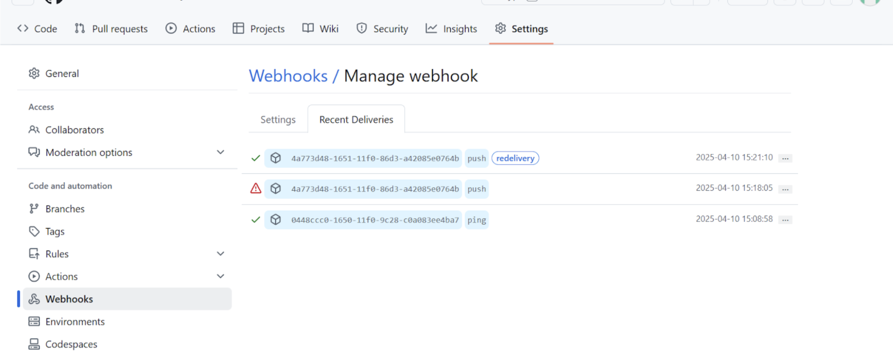

## As part of the second project check-in, Jenkins was successfully deployed in a GitHub Codespace and integrated with GitHub for automated CI/CD.

## Jenkins was launched using a WAR file within the GitHub Codespace environment. The Jenkins UI became accessible through the forwarded port: https://bookish-carnival-v6v54474qg7xhww7-8080.app.github.dev/

## Initial Setup & Plugin Installation: 
- Jenkins was initialized with the default admin password
- Required plugins were installed

## GitHub Personal Access Token (PAT)
- A GitHub PAT was generated 
- This token was added in Jenkins under: Manage Jenkins > Credentials > Global > Add Credentials
- Type: Username with password
- Username: GitHub username
- Password: GitHub PAT

## Multibranch Pipeline Setup
- A multibranch pipeline was created in Jenkins using:
- GitHub repository URL 
- Credentials created above
- Jenkinsfile was placed in the root of the project to define pipeline stages

## Webhook Registration
- After saving the Jenkins pipeline config, Jenkins automatically registered a webhook with the GitHub repository.
- Webhook triggers were verified under: GitHub > Repo Settings > Webhooks with the message: ✓ Last delivery was successful

## Validation
- A test push and pull request successfully triggered Jenkins builds.
- This verified that webhook communication between GitHub and Jenkins was functional.

WebHook history showing Jenkins picked up the push commit:

